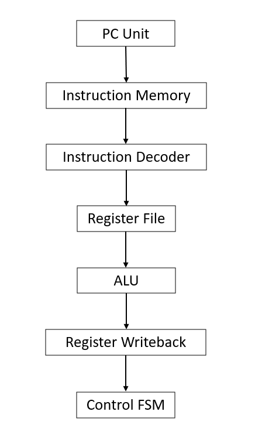
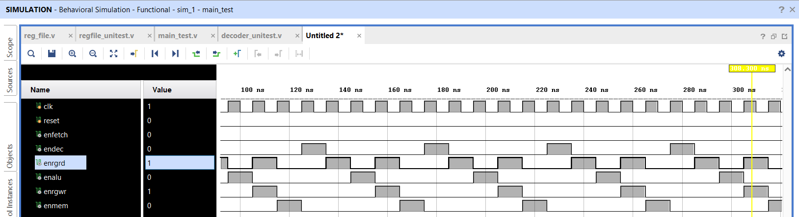
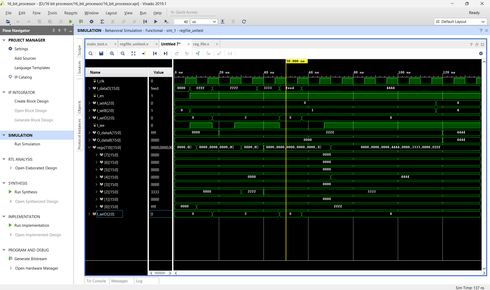
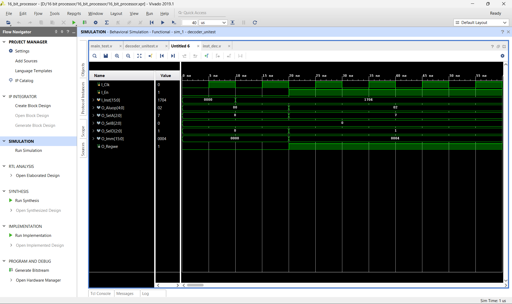
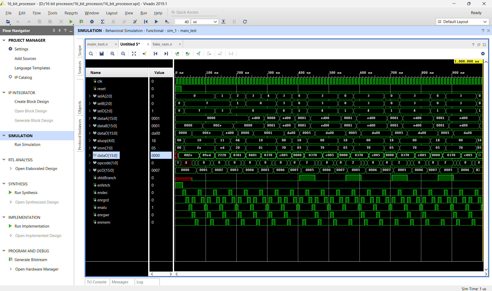

# 16-bit RISC Processor using Verilog HDL

## Overview

This project presents the design and implementation of a custom 16-bit Multi-Cycle RISC Processor using Verilog HDL. The processor supports arithmetic, logical, comparison, shift, load, and branch instructions through an FSM-based control architecture.

The design was developed following a modular RTL methodology and verified using Xilinx Vivado simulation. The processor consists of dedicated modules for instruction decoding, register file operations, ALU execution, program counter control, and FSM-based instruction sequencing.

---

## Key Features

- Custom 16-bit Instruction Set Architecture (ISA)
- Multi-Cycle Processor Architecture
- FSM-Based Control Unit
- Register File with Read/Write Operations
- Arithmetic and Logical ALU Operations
- Branch and Jump Instruction Support
- Modular RTL Design
- Functional Verification using Verilog Testbenches
- FPGA-Oriented Processor Design

---

## Supported Instructions

| Category | Instructions |
|-----------|-------------|
| Arithmetic | ADD, SUB |
| Logical | AND, OR, XOR, NOT |
| Shift Operations | SHL, SHR |
| Comparison | CMP |
| Data Transfer | LOAD |
| Control Flow | JMPA, JMPR |

---

# Processor Architecture

The processor follows a multi-cycle execution flow:

```text
PC Unit
   ↓
Instruction Fetch
   ↓
Instruction Decode
   ↓
Register Read
   ↓
ALU Execute
   ↓
Register Writeback
   ↓
Control FSM
```

### Overall Processor Architecture



---

# Major Modules

## Program Counter (PC)

Maintains instruction sequencing and controls program flow during execution.

## Instruction Memory

Stores machine instructions and provides instruction fetch functionality.

## Instruction Decoder

Decodes instruction fields and generates required control signals.

## Register File

Provides operand storage and supports simultaneous read/write operations.

## Arithmetic Logic Unit (ALU)

Performs arithmetic, logical, comparison, and shift operations.

## Control FSM

Controls the execution sequence of instructions using a multi-cycle state machine.

---

# Simulation Results

## Control FSM Verification

Demonstrates the sequencing of processor control signals across multiple execution stages.



---

## Datapath Execution Verification

Shows instruction execution, ALU operations, register accesses, immediate values, and program counter updates.


---

## Register File Verification

Validates register write operations, register selection logic, and data retrieval functionality.



---

## Instruction Decoder Verification

Demonstrates correct decoding of instructions into control signals and immediate fields.



---

## Full Processor Execution

Complete processor-level verification showing interaction between datapath, ALU, register file, control FSM, and instruction execution flow.



---

# Tools Used

- Verilog HDL
- Xilinx Vivado
- RTL Design Methodology
- FPGA Design Flow
- Digital VLSI Design

---

# Repository Structure

```text
├── src/
│   ├── RTL Source Files
│
├── testbench/
│   ├── Verification Testbenches
│
├── screenshots/
│   ├── 01_risc_processor_architecture.png
│   ├── 02_control_fsm_waveform.png
│   ├── 03_datapath_execution.png
│   ├── 04_register_file_verification.png
│   ├── 05_instruction_decoder_verification.png
│   └── 06_full_processor_execution.png
│
└── README.md
```

---

# Applications

- Embedded Systems
- Processor Design Education
- FPGA-Based Computing Systems
- Computer Architecture Research
- Digital System Design
- RTL Design Training

---

# Key Learnings

- Multi-Cycle Processor Architecture Design
- FSM-Based Control Logic
- Custom Instruction Set Development
- Register File Design
- Instruction Decoding Techniques
- ALU Design and Integration
- Processor Datapath Development
- RTL Verification using Vivado
- FPGA-Oriented Processor Design

---

# Future Improvements

- Pipelined Processor Architecture
- Hazard Detection and Forwarding
- Expanded Instruction Set
- Data Memory Integration
- Cache Memory Support
- FPGA Hardware Deployment
- SystemVerilog-Based Verification Environment

---

# Author

**Dinesh Vardhan Dundi**

Electronics and Communication Engineering

### Areas of Interest

- RTL Design
- FPGA Design
- Digital VLSI
- Computer Architecture
- ASIC Design
- Hardware Accelerators
- AI Hardware Systems
