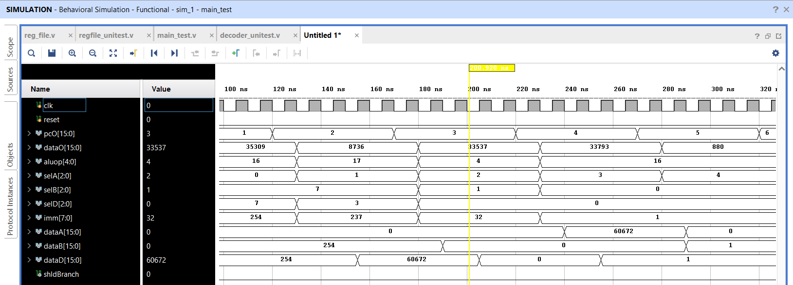

# 16-bit RISC Processor using Verilog HDL

## Overview
Designed and implemented a custom 16-bit multi-cycle RISC Processor using Verilog HDL. The processor supports arithmetic, logical, comparison, shift, load, and branch instructions through an FSM-based control architecture. The design was developed and verified using Xilinx Vivado.

## Features
- Custom 16-bit Instruction Set Architecture (ISA)
- Multi-cycle processor architecture
- FSM-based Control Unit
- Register File with read/write support
- ALU supporting arithmetic and logical operations
- Branch and jump instruction support
- Functional verification using Verilog testbenches
- Modular RTL design methodology

## Supported Instructions
- ADD
- SUB
- AND
- OR
- XOR
- NOT
- LOAD
- CMP
- SHL
- SHR
- JMPA
- JMPR

## Tools Used
- Verilog HDL
- Xilinx Vivado

## Architecture

The processor follows a multi-cycle execution flow:

Instruction Fetch → Decode → Register Read → Execute → Writeback → Memory

### Processor Architecture Diagram


## Project Structure

```text
src/          -> RTL source files
testbench/    -> Verification testbenches
screenshots/  -> Simulation waveforms and architecture diagrams
docs/         -> Additional documentation
```

## Simulation Results

### Control FSM Sequencing

Shows the multi-cycle control flow of the processor.


### Datapath Execution

Shows instruction execution, ALU operations, register reads, and program counter updates.



## Key Learnings

- FSM-based processor control design
- Multi-cycle processor execution
- Custom instruction decoding
- Register file implementation
- ALU arithmetic and logical operations
- Verilog HDL simulation and verification
- Processor datapath integration

## Future Improvements

- Pipeline architecture
- Hazard detection and forwarding
- Expanded instruction memory
- FPGA hardware deployment
- SystemVerilog-based verification
- Cache memory integration

## Author

**Dinesh Vardhan Dundi**

Final-Year Electronics and Communication Engineering Student

Interested in RTL Design, FPGA Development, Digital VLSI, Computer Architecture, and Hardware Acceleration.
